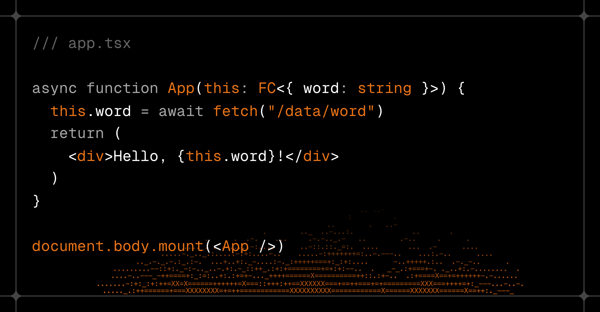

# 🔥 mono-jsx-dom



> [!WARNING]
> This library is currently under active development. The API may change at any time. Use at your own risk. Please report any issues or feature requests on the issues page.

`mono-jsx-dom` is a JSX runtime for building web user interface.

- ⚡️ Use browser-specific APIs, no virtual DOM
- 🦋 Lightweight (4KB gzipped), zero dependencies
- 🚦 Signals as reactive primitives
- 💡 Complete Web API TypeScript definitions
- ⏳ Streaming rendering

Playground: https://val.town/x/ije/mono-jsx-dom

## Installation

```bash
npm install mono-jsx-dom
```

## Setup JSX Runtime

To use mono-jsx-dom as your JSX runtime, add the following configuration to your `tsconfig.json` (or `deno.json` for Deno):

```jsonc
{
  "compilerOptions": {
    "module": "esnext",
    "moduleResolution": "bundler",
    "jsx": "react-jsx",
    "jsxImportSource": "mono-jsx-dom"
  }
}
```

You can also run the `mono-jsx-dom setup` command to set up the environment for `mono-jsx-dom`:

```bash
# npm
npx mono-jsx-dom setup

# bun
bunx --bun mono-jsx-dom setup
```

Or use the `@jsxImportSource` pragma directive to use `mono-jsx-dom` as your JSX runtime:

```tsx
/** @jsxImportSource mono-jsx-dom */

function App() {
  return <div>Hello, world!</div>;
}
```

## Usage

mono-jsx-dom adds a `mount` method to the `HTMLElement` prototype to allow you to mount the UI to the DOM.

```tsx
// app.tsx

function App(this: FC) {
  return <div>Hello, world!</div>;
}

document.body.mount(<App />);
```

To run an app built with `mono-jsx-dom` in the browser, you need a TSX transformer to compile the TSX code to JavaScript. For example, you can use [esbuild](https://esbuild.github.io):

```bash
bunx esbuild --bundle --jsx=automatic --jsx-import-source=mono-jsx-dom --platform=browser --format=esm --target=es2022 --outfile=app.js app.tsx
```

>[!TIP]
> `mono-jsx-dom` is designed for client-side rendering. You can use [mono-jsx](https://github.com/ije/mono-jsx) to render the UI on the server side.

## Using JSX

mono-jsx-dom uses [**JSX**](https://react.dev/learn/describing-the-ui) to describe the user interface, similar to React but with key differences.

### Using Standard HTML Property Names

mono-jsx-dom adopts standard HTML property names, avoiding React's custom naming conventions:

- `className` → `class`
- `htmlFor` → `for`
- `onChange` → `onInput`

### Composition with `class`

mono-jsx-dom allows you to compose the `class` property using arrays of strings, objects, or expressions:

```tsx
<div
  class={[
    "container box",
    isActive && "active",
    { hover: isHover },
  ]}
/>;
```

### Using Pseudo-Classes and Media Queries in `style`

mono-jsx-dom supports [pseudo-classes](https://developer.mozilla.org/en-US/docs/Web/CSS/Pseudo-classes), [pseudo-elements](https://developer.mozilla.org/en-US/docs/Web/CSS/Pseudo-elements), [media queries](https://developer.mozilla.org/en-US/docs/Web/CSS/CSS_media_queries/Using_media_queries), and [CSS nesting](https://developer.mozilla.org/en-US/docs/Web/CSS/CSS_nesting/Using_CSS_nesting) in the `style` property:

```tsx
<a
  style={{
    display: "inline-flex",
    gap: "0.5em",
    color: "black",
    "::after": { content: "↩️" },
    ":hover": { textDecoration: "underline" },
    "@media (prefers-color-scheme: dark)": { color: "white" },
    "& .icon": { width: "1em", height: "1em" },
  }}
>
  
  Link
</a>;
```

<!--
### Using View Transition

mono-jsx-dom supports [View Transition](https://developer.mozilla.org/en-US/docs/Web/API/View_Transitions_API) to create smooth transitions between views. To use view transitions, add the `viewTransition` prop to the following components:

 - `<show viewTransition="view-transition-name">`
 - `<hidden viewTransition="view-transition-name">`
 - `<switch viewTransition="view-transition-name">`

You can set custom transition animations by adding [`::view-transition-group`](https://developer.mozilla.org/en-US/docs/Web/CSS/::view-transition-group), [`::view-transition-old`](https://developer.mozilla.org/en-US/docs/Web/CSS/::view-transition-old), and [`::view-transition-new`](https://developer.mozilla.org/en-US/docs/Web/CSS/::view-transition-new) pseudo-elements with your own CSS animations. For example:

```tsx
function App(this: FC<{ show: boolean }>) {
  return (
    <div
      style={{
        "@keyframes fade-in": { from: { opacity: 0 }, to: { opacity: 1 } },
        "@keyframes fade-out": { from: { opacity: 1 }, to: { opacity: 0 } },
        "::view-transition-group(fade)": { animationDuration: "0.3s" },
        "::view-transition-old(fade)": { animation: "0.3s ease-in both fade-out" },
        "::view-transition-new(fade)": { animation: "0.3s ease-in both fade-in" },
      }}
    >
      <show when={this.show} viewTransition="fade">
        <h1>Hello world!</h1>
      </show>
      <button onClick={() => this.show = !this.show}>Toggle</button>
    </div>
  )
}
```

You can also set the `viewTransition` prop on an HTML element that contains signal children.

```tsx
function App(this: FC<{ message: string }>) {
  this.message = "Hello world!";
  return (
    <h1 viewTransition="fade">{this.message}</h1>
  )
}
```

You can also set the view transition name in the `style` property by setting the `viewTransition` prop to `true`.

```tsx
function App(this: FC<{ message: string }>) {
  this.message = "Hello world!";
  return (
    <h1 viewTransition style={{ viewTransitionName: "fade" }}>{this.message}</h1>
  )
}
```

-->

### Using `<slot>` Element

mono-jsx-dom uses [`<slot>`](https://developer.mozilla.org/en-US/docs/Web/HTML/Element/slot) elements to render slotted content (equivalent to React's `children` property). You can also add the `name` prop to define named slots:

```tsx
function Container() {
  return (
    <div class="container">
      {/* Default slot */}
      <slot />
      {/* Named slot */}
      <slot name="desc" />
    </div>
  )
}

function App() {
  return (
    <Container>
      {/* This goes to the named slot */}
      <p slot="desc">This is a description.</p>
      {/* This goes to the default slot */}
      <h1>Hello world!</h1>
    </Container>
  )
}
```

### Using `html` Tag Function

mono-jsx-dom injects a global `html` tag function to allow you to render raw HTML, which is similar to React's `dangerouslySetInnerHTML`.

```tsx
function App() {
  const title = "Hello world!";
  return <div>{html`<h1>${title}</h1>`}</div>;
}
```

Variables in the `html` template literal are escaped. To render raw HTML without escaping, call the `html` function with a string literal.

```tsx
function App() {
  const title = "<span style='color: blue;'>Hello world!</span>";
  return <div>{html(`<h1>${title}</h1>`)}</div>;
}
```

You can also use `css` and `js` functions for CSS and JavaScript:

```tsx
function App() {
  return (
    <head>
      <style>{css`h1 { font-size: 3rem; }`}</style>
      <script>{js`console.log("Hello world!")`}</script>
    </head>
  )
}
```

> [!WARNING]
> The `html` tag function is **unsafe** and can cause [**XSS**](https://en.wikipedia.org/wiki/Cross-site_scripting) vulnerabilities.

### Event Handlers

mono-jsx-dom lets you write event handlers directly in JSX, similar to React:

```tsx
function Button() {
  return (
    <button onClick={(evt) => alert("BOOM!")}>
      Click Me
    </button>
  )
}
```

mono-jsx-dom allows you to use a function as the value of the `action` prop of the `<form>` element. The function will be called on form submission, and the `FormData` object will contain the form data.

```tsx
function App() {
  return (
    <form action={(data: FormData) => console.log(data.get("name"))}>
      <input type="text" name="name" />
      <button type="submit">Submit</button>
    </form>
  )
}
```

## Async Components

mono-jsx-dom supports async components that return a `Promise` or are declared as async functions. With streaming rendering, async components are rendered asynchronously, allowing you to fetch data or perform other async operations before rendering the component.

```tsx
async function JsonViewer(props: { url: string }) {
  const data = await fetch(props.url).then((res) => res.json());
  return <ObjectViewer data={data} />;
}

function App() {
  return (
    <JsonViewer url="https://example.com/data.json" />
  )
}

document.body.mount(<App />);
```

<!--

You can also use async generators to yield multiple elements over time. This is useful for streaming rendering of LLM tokens:

```tsx
async function* Chat(props: { prompt: string }) {
  const stream = await openai.chat.completions.create({
    model: "gpt-4",
    messages: [{ role: "user", content: prompt }],
    stream: true,
  });

  for await (const event of stream) {
    const text = event.choices[0]?.delta.content;
    if (text) {
      yield <span>{text}</span>;
    }
  }
}

function App() {
  return (
    <Chat prompt="Tell me a story" pending={<span style="color:grey">●</span>} />
  )
}

document.body.mount(<App />);
```

-->

You can use `pending` to display a loading state while waiting for async components to render:

```tsx
async function Sleep({ ms }) {
  await new Promise((resolve) => setTimeout(resolve, ms));
  return <slot />;
}

function App() {
  return (
    <Sleep ms={1000} pending={<p>Loading...</p>}>
      <p>After 1 second</p>
    </Sleep>
  )
}

document.body.mount(<App />);
```

## Error Handling

You can add the `catch` prop to a function component. This allows you to catch errors in components and display a fallback UI:

```tsx
async function Hello() {
  throw new Error("Something went wrong!");
  return <p>Hello world!</p>;
}

function App() {
  return (
    <Hello catch={err => <p>{err.message}</p>} />
  )
}

document.body.mount(<App />);
```


The `catch` prop should be a function that gets the caught error as the first argument and returns a JSX element.

## Using Signals

mono-jsx-dom uses signals to update the view when a signal changes. Signals are similar to React's state, but they are lighter-weight and more efficient. You can use signals to manage state in your components.

### Using Component Signals

You can use the `this` keyword in your components to manage signals. Signals are bound to the component instance, can be updated directly, and automatically re-render the view when they change:

```tsx
function Counter(this: FC<{ count: number }>, props: { initialCount?: number }) {
  // Initialize a signal
  this.count = props.initialCount ?? 0;

  // or you can use `this.init` to initialize the signals
  this.init({ count: props.initialCount ?? 0 });

  return (
    <div>
      {/* render signal */}
      <span>{this.count}</span>

      {/* Update signal to trigger re-render */}
      <button onClick={() => this.count--}>-</button>
      <button onClick={() => this.count++}>+</button>
    </div>
  )
}
```

You can use `this.extend` to create an extended signals object. You can use getters to create derived (computed) signals.

```tsx
function App(this: FC<{ count: number }>) {
  const counter = this.extend({
    value: 0,
    // double is a derived(computed) signal
    get double() {
      return this.value * 2;
    }
  });

  return (
    <div>
      <span>count:{counter.value}</span>
      <span>double: {counter.double}</span>
      <button onClick={() => counter.value++}>+</button>
    </div>
  )
}
```

### Using `atom` and `store`

mono-jsx-dom provides two functions that allow you to define shared global signals. You can use them to share signals between components.

- `atom(initValue)`: Creates an atom signal.
- `store(initValue)`: Creates a signal store.

```ts
export interface Atom<T> {
  get(): T;
  set(value: T | ((prev: T) => T)): void;
  map(callback: (value: T extends (infer V)[] ? V : T, index: number) => JSX.ChildPrimitiveType): JSX.ChildPrimitiveType[];
  ref(): T;
  ref<V>(callback: (value: T) => V): V;
}

export const atom: <T>(initValue: T) => Atom<T>;
export const store: <T extends Record<string, unknown>>(initValue: T) => T;
```

Example:

```tsx
import { atom, store } from "mono-jsx-dom";

const count = atom(0);
const store = store({ text: 'Count:' });

function Counter(this: FC) {
  this.effect(() => {
    console.log("count changed:", count.get());
  });
  return (
   <span>{store.text}{count}</span>
  )
}

function Buttons(this: FC) {
  return (
    <>
      <button onClick={() => count.set(prev => prev+1)}>+</button>
      <button onClick={() => store.text = store.text === 'Count:' ? 'Count:' : '计数:'}>English/中文</button>
    </>
  )
}

function App(this: FC) {
  return (
    <>
      <Counter />
      <Buttons />
    </>
  )
}

document.body.mount(<App />);
```

### Using Computed Signals

You can use `this.computed` to create a derived signal based on other signals:

```tsx
function App(this: FC<{ input: string }>) {
  this.input = "Welcome to mono-jsx";
  return (
    <div>
      <h1>{this.computed(() => this.input + "!")}</h1>
      <input type="text" $value={this.input} />
    </div>
  )
}
```

> [!TIP]
> You can use `this.$` as a shorthand for `this.computed` to create computed signals.

### Using Effect

You can use `this.effect` to perform side effects in components. The effect runs when the component is mounted, automatically collects used signals as dependencies, and reruns when those dependencies change.

```tsx
function App(this: FC<{ count: number }>) {
  this.count = 0;

  this.effect(() => {
    console.log("Count:", this.count);
  });

  return (
    <div>
      <span>{this.count}</span>
      <button onClick={() => this.count++}>+</button>
    </div>
  )
}
```

The callback function of `this.effect` can return a cleanup function that runs once the component's element has been removed through `<show>`, `<hidden>`, or `<switch>` conditional rendering:

```tsx
function Counter(this: FC<{ count: number }>) {
  this.count = 0;

  this.effect(() => {
    const interval = setInterval(() => {
      this.count++;
    }, 1000);

    return () => clearInterval(interval);
  });

  return (
    <div>
      <span>{this.count}</span>
    </div>
  )
}

function App(this: FC<{ show: boolean }>) {
  return (
    <div>
      <show when={this.show}>
        <Counter />
      </show>
      <button onClick={() => this.show = !this.show }>{this.$(() => this.show ? 'Hide': 'Show')}</button>
    </div>
  )
}
```

### Using `<show>` Element with Signals

The `<show>` element conditionally renders content based on the `when` prop. You can use signals to control the visibility of the content on the client side.

```tsx
function App(this: FC<{ show: boolean }>) {
   const toggle = () => {
    this.show = !this.show;
  }

  return (
    <div>
      <show when={this.show}>
        <h1>Welcome to mono-jsx!</h1>
      </show>

      <button onClick={toggle}>
        {this.$(() => this.show ? "Hide" : "Show")}
      </button>
    </div>
  )
}
```

mono-jsx-dom also provides a `<hidden>` element that is similar to `<show>`, but it conditionally hides the content based on the `when` prop.

```tsx
function App(this: FC<{ hidden: boolean }>) {
  return (
    <div>
      <hidden when={this.hidden}>
        <h1>Welcome to mono-jsx!</h1>
      </hidden>
    </div>
  )
}
```

If you need `if-else` logic in JSX, use the `<switch>` element instead:

```tsx
function App(this: FC<{ ok: boolean }>) {
  return (
    <div>
      <switch value={this.ok}>
        <span slot="true">True</span>
        <span slot="false">False</span>
      </switch>
    </div>
  )
}
```

### Using `<switch>` Element with Signals

The `<switch>` element renders different content based on the `value` prop. Elements with matching `slot` props are displayed when their value matches, otherwise default slots are shown. Like `<show>`, you can use signals to control the value on the client side.

```tsx
function App(this: FC<{ lang: "en" | "zh" | "🙂" }>) {
  this.lang = "en";

  return (
    <div>
      <switch value={this.lang}>
        <h1 slot="en">Hello, world!</h1>
        <h1 slot="zh">你好，世界！</h1>
        <h1 slot="🙂">✋🌎❗️</h1>
      </switch>
      <p>
        <button onClick={() => this.lang = "en"}>English</button>
        <button onClick={() => this.lang = "zh"}>中文</button>
        <button onClick={() => this.lang = "🙂"}>🙂</button>
      </p>
    </div>
  )
}
```

### Form Input Two-way Binding

You can use the `$value` prop to bind a signal to the value of a form input element. The `$value` prop provides two-way data binding, which means that when the input value changes, the signal is updated, and when the signal changes, the input value is updated.

```tsx
function App(this: FC<{ value: string }>) {
  this.value = "Welcome to mono-jsx";
  this.effect(() => {
    console.log("value changed:", this.value);
  });
  // return <input value={this.value} oninput={e => this.value = e.target.value} />;
  return <input $value={this.value} />;
}
```

You can also use the `$checked` prop to bind a signal to the checked state of a checkbox or radio input.

```tsx
function App(this: FC<{ checked: boolean }>) {
  this.effect(() => {
    console.log("checked changed:", this.checked);
  });
  // return <input type="checkbox" checked={this.checked} onchange={e => this.checked = e.target.checked} />;
  return <input type="checkbox" $checked={this.checked} />;
}
```

### Limitations of Signals

1\. Arrow functions are non-stateful components.

```tsx
// ❌ Won't work - uses `this` in a non-stateful component
const App = () => {
  this.count = 0;
  return (
    <div>
      <span>{this.count}</span>
      <button onClick={() => this.count++}>+</button>
    </div>
  )
};

// ✅ Works correctly
function App(this: FC) {
  this.count = 0;
  return (
    <div>
      <span>{this.count}</span>
      <button onClick={() => this.count++}>+</button>
    </div>
  )
}
```

2\. Signals cannot be computed outside of the `this.computed` method.

```tsx
// ❌ Won't work - updates of a signal won't refresh the view
function App(this: FC<{ message: string }>) {
  this.message = "Welcome to mono-jsx";
  return (
    <div>
      <h1 title={this.message + "!"}>{this.message + "!"}</h1>
      <button onClick={() => this.message = "Clicked"}>
        Click Me
      </button>
    </div>
  )
}

// ✅ Works correctly
function App(this: FC) {
  this.message = "Welcome to mono-jsx";
  return (
    <div>
      <h1 title={this.$(() => this.message + "!")}>{this.$(() => this.message + "!")}</h1>
      <button onClick={() => this.message = "Clicked"}>
        Click Me
      </button>
    </div>
  )
}
```

## Using `this` in Components

mono-jsx-dom binds a scoped signals object to `this` in your component functions. This allows you to access signals, context, and request information directly in your components.

The `this` object has the following built-in properties:

- `extend(initValue)`: Extends the signals object.
- `init(initValue)`: Initializes the signals.
- `refs`: A map of refs defined in the component.
- `computed(fn)`: A method to create a computed signal.
- `$(fn)`: A shortcut for `computed(fn)`.
- `effect(fn)`: A method to create side effects.

```ts
type FC<Signals = {}, Refs = {}> = {
  extend<T extends Record<string, unknown>>(initValue: T): FC<T>;
  init(initValue: Signals): void;
  refs: Refs;
  computed<T = unknown>(fn: () => T): T;
  $: FC["computed"]; // A shortcut for `FC.computed`.
  effect(fn: () => void | (() => void)): void;
} & Signals;
```

### Using Signals

See the [Using Signals](#using-signals) section for more details on how to use signals in your components.

### Using Refs

You can use `this.refs` to access refs in your components. Refs are defined using the `ref` prop in JSX, and they allow you to access DOM elements directly. The `refs` object is a map of ref names to DOM elements.

```tsx
function App(this: WithRefs<FC, { input?: HTMLInputElement }>) {
  this.effect(() => {
    this.refs.input?.addEventListener("input", (evt) => {
      console.log("Input changed:", evt.target.value);
    });
  });

  return (
    <div>
      <input ref={this.refs.input} type="text" />
      <button onClick={() => this.refs.input?.focus()}>Focus</button>
    </div>
  )
}
```
